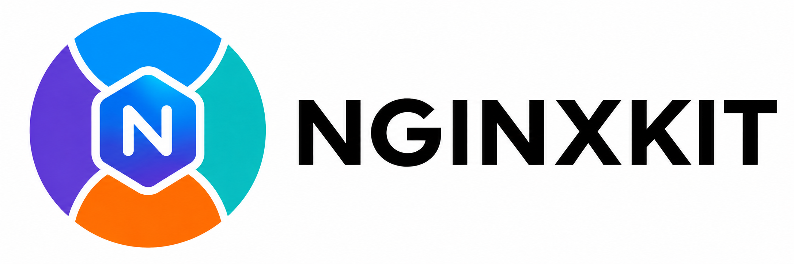

_"It starts with Nginx, but goes beyond Nginx."_

One Nginx family, four different personalities — all source-built, all Alpine, all in Docker 🐳.

## Design

- Built from source for transparency and control.
- Built exclusively on Alpine Linux to keep the base lightweight and consistent.
- Build dependencies and unnecessary files are removed after compilation to keep runtime images lean.
- Selected third-party modules are included where they add practical value.
- Each image stays close to its upstream project while maintaining a consistent container experience.

## Philosophy

Nginx is the starting point, not the finish line.

Each image stays close to its upstream project, with an emphasis on leaner builds, practical defaults, and production-oriented packaging.

[docker-nginxkit][1] focuses on keeping the images simple, focused, and easy to work with.

## License

[2-clause BSD-like license](./LICENSE)

[1]: https://github.com/honeok/docker-nginxkit
